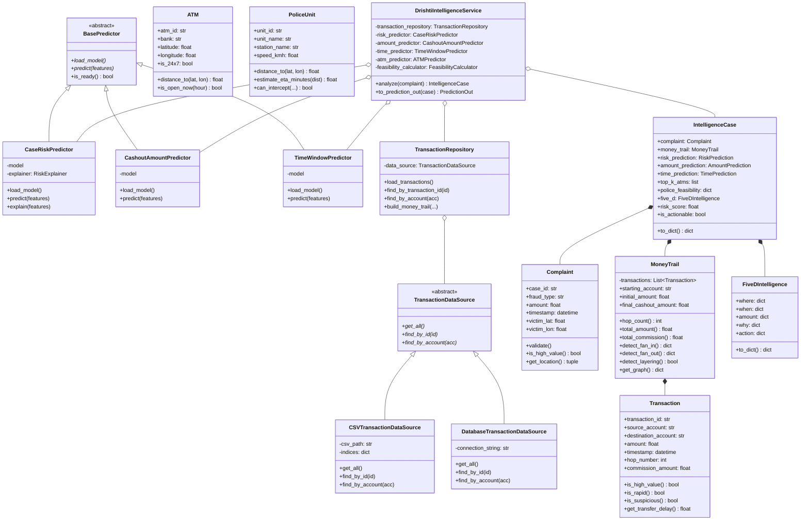

# PROJECT DRISHTI — OBJECT-ORIENTED ARCHITECTURE SPECIFICATION

> **Production-Grade OOP Architecture for Real-Time Cyber-Financial Intelligence**

---

## 1. Executive Summary & Design Rationale

PROJECT DRISHTI is built with an enterprise-grade, clean **Object-Oriented Programming (OOP)** architecture in Python. Rather than treating classes as syntactic boilerplate, the OOP implementation delivers:

1. **Modularity**: Clean separation of Domain Models, Repositories, ML Predictors, Strategies, Calculators, and Application Services.
2. **Separation of Concerns**: HTTP controllers in `backend/routes/` are thin and only handle transport, deserialization, and status codes; business and predictive orchestration reside entirely in service facades.
3. **Pluggable Extensibility**: Storage, ML models, and ranking strategies can be substituted (e.g., CSV &rarr; PostgreSQL/Snowflake, RandomForest &rarr; XGBoost/LightGBM, Heuristic &rarr; Neural Network) without breaking client APIs or pipeline orchestration.
4. **Testability via Dependency Injection**: All services accept collaborator interfaces, allowing unit tests to inject mocks and run hermetically without database or model files.
5. **Zero Latency Regression**: Heavy ML models are wrapped in lazy/singleton abstractions, preserving DRISHTI's sub-second latency and fast startup.

---

## 2. Architecture Overview & Component Flow

```text
HTTP Request (POST /predict)
           │
           ▼
   [API Route Controller] (Thin transport handler)
           │
           ▼ (Dependency Injection)
   [DrishtiIntelligenceService] (Central Orchestrator Facade)
           │
  ┌────────┼────────────────────────────────────────────────────────┐
  │        │                                                        │
  ▼        ▼                                                        ▼
[Domain Models]               [Repositories]                [ML Predictor Hierarchy]
  • Complaint                   • TransactionRepository       • BasePredictor (ABC)
  • Transaction                   - CSVTransactionDataSource    ├── CaseRiskPredictor
  • MoneyTrail (Composite)        - DatabaseTransactionSource   ├── CashoutAmountPredictor
  • ATM                         • UserRepository                └── TimeWindowPredictor
  • PoliceUnit                                              [Polymorphic Strategies]
  • IntelligenceCase (Composite)                                • PredictionStrategy
  • FiveDIntelligence                                             ├── MLPredictionStrategy
                                                                  └── HeuristicStrategy
                                                                • ATMScoringStrategy
                                                                  ├── DistanceScoringStrategy
                                                                  ├── RiskScoringStrategy
                                                                  └── CompositeATMStrategy
```

---

## 3. Core OOP Principles Demonstrated

| OOP Concept | DRISHTI Implementation | Business & Architectural Impact |
| :--- | :--- | :--- |
| **Encapsulation** | `Complaint`, `Transaction`, `ATM`, `PoliceUnit`, `PasswordHasher`, `SessionManager` | Internal state, business validation rules, spatial formulas, and sensitive credentials remain protected inside entities. |
| **Abstraction** | `BasePredictor` (ABC), `TransactionDataSource` (ABC), `PredictionStrategy` (ABC), `ATMScoringStrategy` (ABC) | Callers interact with abstract contracts; storage and model engines are decoupled from high-level workflows. |
| **Inheritance** | `CaseRiskPredictor(BasePredictor)`, `CashoutAmountPredictor(BasePredictor)`, `TimeWindowPredictor(BasePredictor)` | Specialized predictors share common lifecycle hooks (`load_model`, `predict`, `is_ready`) while tailoring feature engineering and output formats. |
| **Polymorphism** | `MLPredictionStrategy` vs `HeuristicPredictionStrategy`; `DistanceScoringStrategy` vs `RiskScoringStrategy` | Predictors and scoring engines can swap algorithms transparently at runtime; responses explicitly tag `model_source` ("trained_ml" vs "heuristic_fallback"). |
| **Composition** | `MoneyTrail` contains `Transaction`s; `IntelligenceCase` aggregates `Complaint`, `MoneyTrail`, `RiskPrediction`, `AmountPrediction`, `TimePrediction`, `ATM`s, and `FiveDIntelligence` | Rich composite structures represent real-world relationships without rigid deep inheritance trees. |
| **Dependency Injection** | `DrishtiIntelligenceService(...)`, `AuthenticationService(...)`, `TransactionRepository(...)` | Dependencies are injected via constructor, enabling 100% isolated unit testing and mock injection. |
| **Facade Pattern** | `DrishtiIntelligenceService`, `AuthenticationService` | Simplifies complex multi-step pipelines behind a clean, single-method interface (`analyze(...)`, `authenticate(...)`). |
| **Factory Pattern** | `PredictorFactory.create_predictor(...)` | Centralizes model instantiation by type name (`"risk"`, `"amount"`, `"time"`). |

---

## 4. Class Relationship Diagram (Mermaid)



---

## 5. Domain Layer Details

### 5.1 `Complaint` (`backend/domain/complaint.py`)
- Encapsulates citizen cybercrime complaints.
- Enforces strict domain validation on non-empty identifiers, non-negative amounts, and valid WGS84 geographic boundaries (`-90 <= lat <= 90`, `-180 <= lon <= 180`).
- Helper methods: `is_high_value(threshold=50000)`, `has_location()`, `get_location()`, `to_dict()`.

### 5.2 `Transaction` (`backend/domain/transaction.py`)
- Encapsulates individual financial transactions.
- Encapsulates laundering domain rules:
  - `is_high_value(threshold=50000)`
  - `is_rapid(previous_event, threshold_minutes=15)`
  - `is_suspicious()`: flags transactions combining high value, mule commission shaving, or hop depth $\ge 3$.
  - `get_transfer_delay(previous_event)`: computes exact inter-transfer velocity.

### 5.3 `MoneyTrail` (`backend/domain/money_trail.py`)
- Demonstrates **Composition** over a list of `Transaction` objects.
- Responsibilities:
  - `hop_count()`: Depth of fund dispersal.
  - `total_amount()`, `total_commission()`: Aggregate financial dissipation.
  - `detect_fan_in()`, `detect_fan_out()`: Topological multi-source and multi-destination laundering detection.
  - `detect_layering()`: True when fund movement passes through 3 or more layering accounts.
  - `get_graph()`: Constructs structured node/edge graph representation ready for NetworkX and visualization.

### 5.4 `ATM` & `PoliceUnit` (`backend/domain/atm.py`, `backend/domain/police_unit.py`)
- `ATM`: Encapsulates cash terminal state, spatial Haversine distance, and 24x7 operational windows.
- `PoliceUnit`: Encapsulates patrol unit coordinates, station affiliation, transit speeds, road-traffic adjustment factor (1.35x), and interception feasibility check `can_intercept()`.

### 5.5 `FiveDIntelligence` & `IntelligenceCase` (`backend/domain/intelligence_case.py`)
- `FiveDIntelligence`: Pure domain representation of WHERE, WHEN, AMOUNT, WHY, and ACTION.
- `IntelligenceCase`: Central aggregate root combining Complaint, Money Trail, Risk, Amount, Time, ATM candidates, Police Feasibility, and 5D synthesis into a single cohesive domain entity.

---

## 6. Machine Learning Model Abstraction & Strategies

### 6.1 `BasePredictor` & Factory (`backend/ml/base_predictor.py`)
Abstract Base Class defining the predictor contract:
```python
class BasePredictor(ABC):
    @abstractmethod
    def load_model(self) -> None: pass

    @abstractmethod
    def predict(self, features: Dict[str, Any]) -> Dict[str, Any]: pass

    @abstractmethod
    def is_ready(self) -> bool: pass
```
`PredictorFactory` provides loose coupling:
```python
risk_predictor = PredictorFactory.create_predictor("risk")
amount_predictor = PredictorFactory.create_predictor("amount")
time_predictor = PredictorFactory.create_predictor("time")
```

### 6.2 Polymorphic Strategies (`backend/strategies/`)
- `PredictionStrategy`: ABC providing `MLPredictionStrategy` (active model inference) and `HeuristicPredictionStrategy` (domain fallback). Each prediction explicitly reports its provenance in `model_source` ("trained_ml" vs "heuristic_fallback").
- `ATMScoringStrategy`: ABC providing `DistanceScoringStrategy` (spatial decay), `RiskScoringStrategy` (syndicate risk), and `CompositeATMScoringStrategy` (weighted composition).

---

## 7. Data Access & Repositories

- `TransactionDataSource`: ABC decoupling storage from domain logic.
- `CSVTransactionDataSource`: Fast in-memory indexing by Transaction ID and Account number.
- `DatabaseTransactionDataSource`: Plug-and-play SQL database source for live banking connections.
- `TransactionRepository`: High-level domain repository providing `find_by_transaction_id`, `find_by_account`, and `build_money_trail`.
- `UserRepository`: Decouples user lookup and last-login tracking from authentication route controllers.

---

## 8. Authentication Architecture

- `PasswordHasher`: Encapsulates constant-time bcrypt hashing with dummy verification to mitigate timing attacks.
- `SessionManager`: Encapsulates JWT creation, decoding, and expiration tracking.
- `AuthenticationService`: Central facade orchestrating rate limiting, user repository lookup, credential verification, and token issuance.

---

## 9. Thin Route Controllers

Before refactoring, `backend/routes/predict.py` and `backend/routes/auth.py` contained multi-hundred-line monolithic blocks of database queries, graph traversal, and ML evaluation.

With this OOP architecture:
- `POST /predict/`: Deserializes request into `Complaint`, delegates to `DrishtiIntelligenceService.analyze(complaint)`, and returns `service.to_prediction_out(case)`.
- `POST /auth/login`: Delegates to `AuthenticationService.authenticate(...)` and returns `TokenResponse`.

Controllers only handle HTTP protocol concerns, making the entire business core 100% testable without web servers.

---

## 10. Verification & Test Coverage

The OOP architecture has been verified against the complete test suite:
- `tests/test_oop_architecture.py`: 17 dedicated OOP tests covering encapsulation, polymorphism, composition, repositories, DI, and end-to-end orchestration.
- `tests/test_auth.py`: 38 tests covering authentication, rate limiting, and roles.
- `tests/test_master_suite.py`: 14 tests covering datasets, demo cases, models, and graph.
- `tests/test_ml_rigorous.py`: 12 tests covering conformal intervals, leakage prevention, and drift.
- **Total Pytest Suite**: **81 passed / 81 tests (100% pass rate)**.
- `test_5d_pipeline.py`: End-to-end 5D pipeline tests verified.
- `scripts/final_validation.py`: 34 / 34 acceptance checks passed.
- `npm run build`: Frontend production bundle verified.
