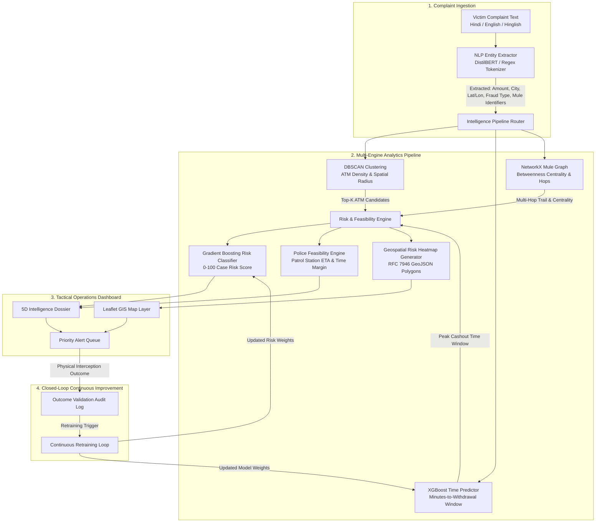

# Project DRISHTI 🛡️
### 5D Cybercrime Intelligence, Hotspot Tracking & Tactical Interception Platform
**Smart India Hackathon 2026 | Problem Statement ID: SIH26184**  
**Ministry of Home Affairs (MHA) | Theme: Blockchain & Cybersecurity**

---

[](https://fastapi.tiangolo.com)
[](https://react.dev)
[](https://leafletjs.com)
[](https://xgboost.readthedocs.io)
[](https://scikit-learn.org)
[](https://networkx.org)
[](LICENSE)

---

## 📌 Problem Statement Overview (SIH26184)

In digital financial cybercrimes across India (such as **UPI scams, KYC phishing, job frauds, and SIM swap schemes**), criminals rapidly siphon illicit funds through layered networks of **mule bank accounts** before physically withdrawing the money as untraceable cash at automated teller machines (ATMs).

### The Critical 30–60 Minute "Golden Window"
- **The Challenge:** Once stolen money is withdrawn in cash from an ATM, the recovery probability drops to near **zero**. Law enforcement currently relies on reactive, post-incident bank statements that take days or weeks to process.
- **The Solution:** **Project DRISHTI** (*Detection and Real-time Intelligence for Surveillance, Hotspot Tracking, and Interception*) provides an end-to-end, sub-second predictive analytics framework that transforms raw victim complaint text into **5D Actionable Intelligence** before the cash leaves the ATM.

---

## 🎯 The 5D Predictive Intelligence Framework

Project DRISHTI synthesizes raw unstructured complaints into five operational dimensions for police dispatchers and cyber cells:

| Dimension | AI / Analytics Engine | Operational Output |
| :--- | :--- | :--- |
| **📍 WHERE** | **DBSCAN Spatial Clustering** ($\epsilon = 500\text{m}$) | Predicts Top-K candidate ATM withdrawal clusters, GPS coordinates, search radii, and cluster density. |
| **⏱️ WHEN** | **XGBoost Regressor v2.0** ($\text{MAE} \approx 6.2\text{m}$) | Predicts the exact minutes-to-withdrawal window, peak cash-out time, and tactical interception countdown. |
| **💰 AMOUNT** | **Syndicate Mule Skimming Model** | Calculates net cash-out volume arriving at the ATM after subtracting layered laundering commission cuts. |
| **🧠 WHY** | **Gradient Boosting Classifier + SHAP** | Computes a 0–100 AI Case Risk score with explainability feature attributions detailing risk drivers. |
| **⚡ ACTION** | **Haversine Feasibility & Dispatch Engine** | Pairs the case with the nearest patrol station, calculates vehicle ETA, determines time margin, and issues SOP directives. |

---

## 🏗️ System Architecture



---

## ⚡ Key Capabilities & Features

### 1. Multi-Hop Money-Trail Visualization
- Traces layered laundering transactions across mule accounts: $\text{Victim} \xrightarrow{\text{IMPS}} \text{Layer 1 Mule} \xrightarrow{\text{UPI}} \text{Layer 2 Mule} \xrightarrow{\text{ATM}} \text{Cash}$.
- Visualizes hop-by-hop latency, transaction fees deducted by syndicates, and high betweenness centrality nodes flagged for emergency freezing under **Section 91 CrPC**.

### 2. Interactive Leaflet GIS with Risk Heatmap Layer
- **Real-Time Hotspot Perimeters:** Visualizes primary withdrawal clusters with animated pulsing radar markers and candidate alternatives (#1, #2, #3).
- **Geospatial Density Heatmap:** Dynamic overlay showing high-risk core interception perimeters (500m) and secondary escape corridors (1.5km), complete with an interactive toggle (`🔥 Heatmap: ON/OFF`) and a gradient density scale legend.
- **Tactical Dispatch Vector:** Displays the nearest police station/interceptor van and draws the direct dispatch route polyline.

### 3. Tactical 5D Intelligence Dossier
- Clean, high-contrast, law-enforcement ops interface presenting:
  - **WHERE:** Target ATM name, coordinates, cluster count, and radius.
  - **WHEN:** Earliest, peak, and latest withdrawal times, with operational time margins.
  - **AMOUNT:** Reported victim loss vs net estimated cash-out.
  - **WHY:** Model rationale and SHAP-style attribution pills (e.g., `+High Impact: High Transaction Amount`).
  - **ACTION:** Step-by-step Standard Operating Procedures (SOP) with one-click clipboard dispatch export.

### 4. Ranked Top-K ATM Candidates
- Ranked candidate withdrawal locations with softmax probability confidence bars.
- One-click **`Focus on Map`** button that flies the Leaflet map directly to any selected ATM cluster.

### 5. Risk × Feasibility Priority Indicator
- Composite priority scoring ($P = \text{Risk Score} \times \text{Feasibility Margin}$) classifying alerts into:
  - `P1 · CRITICAL INTERCEPT` ($\ge 75$)
  - `P2 · ELEVATED INTERCEPT` ($45\text{--}74$)
  - `P3 · ROUTINE AUDIT` ($< 45$)

### 6. Closed-Loop Feedback & Active Retraining
- Dispatched officers record ground-truth outcomes (interception success, location accuracy, recovered amount).
- Incremental retraining engine ingests validated audit records via `/alerts/feedback/retrain` to update model thresholds dynamically.

---

## 📁 Repository Structure

```
PROJECT DRISHTI/
├── backend/
│   ├── clustering/
│   │   ├── hotspot.py            # DBSCAN ATM clustering & Top-K candidates
│   │   └── geo_risk.py           # GeoJSON risk density zone generator
│   ├── ml/
│   │   ├── train_xgboost.py      # XGBoost withdrawal time model training
│   │   ├── train_risk_model.py   # GradientBoosting risk model training
│   │   ├── risk_predictor.py     # AI Case Risk scoring service
│   │   ├── mule_graph.py         # NetworkX multi-hop mule graph engine
│   │   ├── feasibility.py        # Police patrol station registry & ETA engine
│   │   ├── explainability.py     # 5D Intelligence synthesis & explainability
│   │   └── retrain_feedback.py   # Continuous learning & retraining loop
│   ├── nlp/
│   │   └── extractor.py          # Multilingual regex/keyword entity parser
│   ├── routes/
│   │   ├── health.py             # GET /health
│   │   ├── predict.py            # POST /predict (Core 5D pipeline)
│   │   └── feedback.py           # Outcome audit & retraining endpoints
│   └── models.py                 # Pydantic v2 domain schemas
├── frontend/
│   ├── src/
│   │   ├── components/
│   │   │   ├── AboutModal.jsx         # SIH context & 5D architecture modal
│   │   │   ├── AlertCard.jsx          # Ranked priority queue alert card
│   │   │   ├── ComplaintForm.jsx      # Complaint form with quick-load presets
│   │   │   ├── FiveDDetailPanel.jsx   # 5D Intelligence Dossier view
│   │   │   ├── HotspotMap.jsx         # Leaflet GIS with risk heatmap & legend
│   │   │   ├── MoneyTrailFlow.jsx     # Visual multi-hop transaction flow
│   │   │   ├── OutcomeModal.jsx       # Field outcome validation modal
│   │   │   └── TopKLocationsPanel.jsx # Ranked candidate ATMs with map focus
│   │   ├── api.js                     # Centralized Axios API client
│   │   ├── App.jsx                    # Main 3-column tactical dashboard
│   │   ├── App.css                    # Ops-grade tactical CSS design system
│   │   └── main.jsx                   # React entry point
│   ├── package.json
│   └── vite.config.js
├── data/                         # Pre-generated synthetic ATM & crime datasets
├── models/                       # Trained joblib model artifacts
├── main.py                       # FastAPI application entry point
├── generate_data.py              # Synthetic Indian cybercrime dataset generator
├── requirements.txt              # Python dependencies
├── test_5d_pipeline.py           # End-to-end 5D pipeline test suite
└── README.md
```

---

## 🚀 Getting Started

### Prerequisites
- **Python:** 3.10 or higher
- **Node.js:** 18.x or higher & npm
- **Operating System:** Windows, macOS, or Linux

---

### 1. Clone the Repository
```bash
git clone https://github.com/<your-username>/project-drishti.git
cd project-drishti
```

### 2. Backend Setup
```bash
# Create and activate virtual environment
python -m venv venv

# Windows (PowerShell):
.\venv\Scripts\Activate.ps1
# Linux / macOS:
source venv/bin/activate

# Install dependencies
pip install -r requirements.txt
```

### 3. Generate Data & Train Models (Optional — Pre-trained artifacts included)
```bash
# Generate synthetic dataset for Indian metropolitan regions
python generate_data.py

# Train ML models
python -m backend.ml.train_xgboost
python -m backend.ml.train_risk_model
```

### 4. Run the Backend API
```bash
python -m uvicorn main:app --host 127.0.0.1 --port 8000 --reload
```
- API will be live at: `http://127.0.0.1:8000`
- Interactive Swagger documentation: `http://127.0.0.1:8000/docs`

---

### 5. Frontend Setup
In a separate terminal window:
```bash
cd frontend

# Install npm packages
npm install

# Start Vite development server
npm run dev
```
- Dashboard will open at: `http://localhost:3000`

---

## 🧪 Running Automated Tests

Project DRISHTI includes an automated test suite verifying all 8 core capabilities:

```bash
python test_5d_pipeline.py
```

### Test Suite Verification Checklist:
- `[PASS]` `GET /health` returns 200 OK
- `[PASS]` `POST /predict` returns 200 OK with full 5D schema:
  - `[Cap 1]` Multi-hop money trail traced with laundering skimming cuts
  - `[Cap 2]` AI case risk score computed ($0\text{--}100$)
  - `[Cap 3]` 5D Intelligence synthesized (WHERE, WHEN, AMOUNT, WHY, ACTION)
  - `[Cap 4]` Top-K candidate ATM clusters ranked with softmax probabilities
  - `[Cap 5]` RFC 7946 compliant GeoJSON risk heatmap layer generated
  - `[Cap 6]` Police patrol station paired with vehicle ETA & time margin
- `[PASS]` `POST /alerts/{id}/outcome` logs ground-truth validation
- `[PASS]` `GET /alerts/feedback/stats` computes operational interception statistics
- `[PASS]` `POST /alerts/feedback/retrain` executes continuous learning loop

---

## 📡 REST API Reference

### `POST /predict`
Submits an unstructured or structured cybercrime complaint for 5D predictive intelligence.

**Request Payload:**
```json
{
  "complaint_text": "Mujhe Google Pay pe ek link aaya aur uspe click karne ke baad 35000 rupay nikal gaye.",
  "victim_lat": 19.076,
  "victim_lon": 72.877,
  "fraud_type": "upi_fraud",
  "amount": 35000.0
}
```

**Response Payload (Truncated):**
```json
{
  "complaint_id": "DRISHTI-A1B2C3D4",
  "fraud_type": "upi_fraud",
  "amount": 35000.0,
  "risk_score": 62.4,
  "risk_tier": "HIGH",
  "five_d": {
    "where": {
      "primary_hotspot_name": "State Bank of India Standalone ATM",
      "lat": 19.0812,
      "lon": 72.8834,
      "radius_km": 0.6
    },
    "when": {
      "earliest_minutes": 25,
      "peak_minutes": 38,
      "latest_minutes": 52,
      "operational_countdown": "38 mins to peak cash-out"
    },
    "amount": {
      "reported_loss": 35000.0,
      "estimated_cashout_amount": 32121.0
    },
    "why": {
      "summary": "High risk UPI diversion pattern targeting commercial ATM cluster.",
      "factor_attributions": [
        { "factor": "High Transaction Velocity", "impact": "HIGH" }
      ]
    },
    "action": {
      "urgency_badge": "IMMEDIATE INTERCEPT",
      "dispatch_unit": "Andheri East Station (Unit 3)",
      "primary_action": "Deploy Interceptor Unit 3 to Station Road ATM cluster."
    }
  },
  "top_k_locations": [ ... ],
  "money_trail": { ... },
  "feasibility": { ... },
  "geojson_risk_layer": { ... }
}
```

---

## 🛡️ Security & Law Enforcement Compliance

- **No External Paid APIs:** The entire pipeline (NLP, XGBoost, DBSCAN, NetworkX) runs completely locally on CPU/GPU without transmitting sensitive police telemetry to third parties.
- **Statutory Alignment:** Automated SOP recommendations cite legal grounds under **Section 91 CrPC** and standard operating guidelines aligned with the **Indian Cyber Crime Coordination Centre (I4C)** and National Cyber Crime Reporting Portal (NCRP).
- **Data Privacy:** Synthetic data generators ensure zero Personally Identifiable Information (PII) leakage during evaluation.

---

## 🏆 Smart India Hackathon (SIH 2026)

- **Problem Statement:** SIH26184
- **Organization:** Ministry of Home Affairs (MHA)
- **Category:** Software
- **Theme:** Blockchain & Cybersecurity

---

## 📜 License

This project is licensed under the MIT License — see the [LICENSE](LICENSE) file for details.
"# PROJECT-DRISHTI" 
